# Мини-веб сервис на Spring Boot

## Описание проекта
Данный мини-веб сервис разработан на Spring Boot с использованием Rest-архитектуры. Сервис предоставляет API для управления пользователями и их альбомами, демонстрируя следующие возможности:

- Подключение к базе данных H2 (тестовые данные инициализируются через `data.sql`)
- Использование JPA/Hibernate для работы с данными
- Интеграция со сторонним API (JSONPlaceholder)
- Доступ к H2 Console для просмотра данных

## Функционал API

### Управление пользователями
- `POST /users` - создание пользователя
- `GET /users` - получение списка всех пользователей
- `GET /users/{id}` - поиск пользователя по ID
- `DELETE /users/{id}` - удаление пользователя

### Управление альбомами
- `POST /albums` - добавление альбома
- `GET /albums` - получение всех альбомов
- `GET /albums/{Id}` - получение альбома по ID
- `GET /albums/user/{userId}` - получение альбомов конкретного пользователя
- `DELETE /albums/{id}` - удаление альбома

### Работа с внешним API (JSONPlaceholder)
- `GET /albums/external` - получение всех альбомов из внешнего API
- `GET /albums/external/{id}` - получение конкретного альбома по ID
- `GET /albums/external/users/{Id}` - получение альбомов пользователя из внешнего API

### Встроенные инструменты

#### H2 Console
Доступна по адресу: [http://localhost:8080/h2-console](http://localhost:8080/h2-console)  
Данные для входа:
- Логин: `user`
- Пароль: `testing`
- URL: `jdbc:h2:mem:testdb`

## Тестирование API

### Примеры запросов

#### 1. Создание пользователя:
   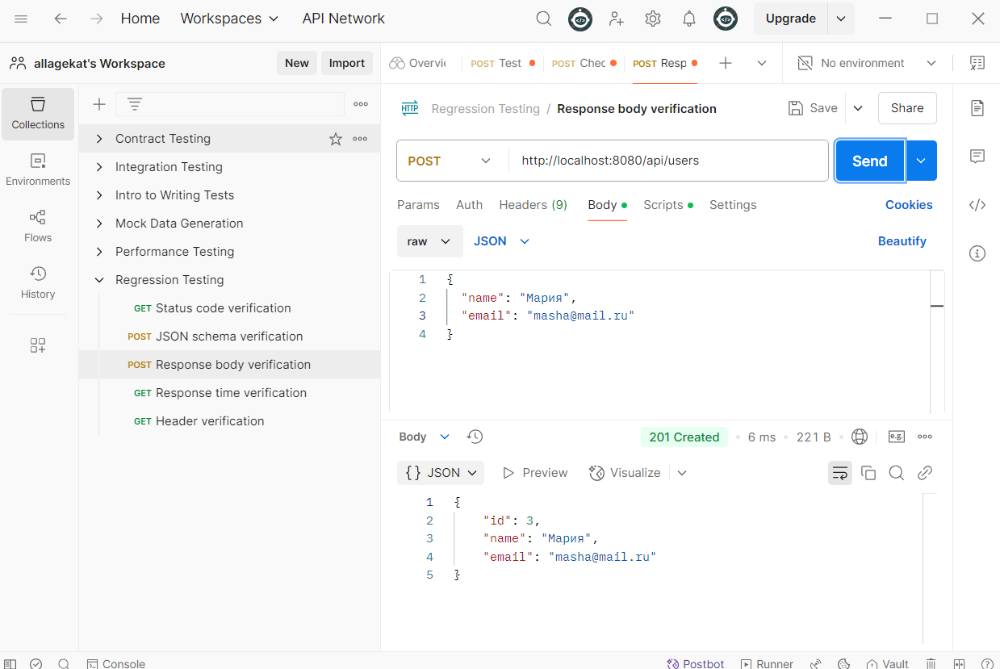

#### 2. Создание альбома:
   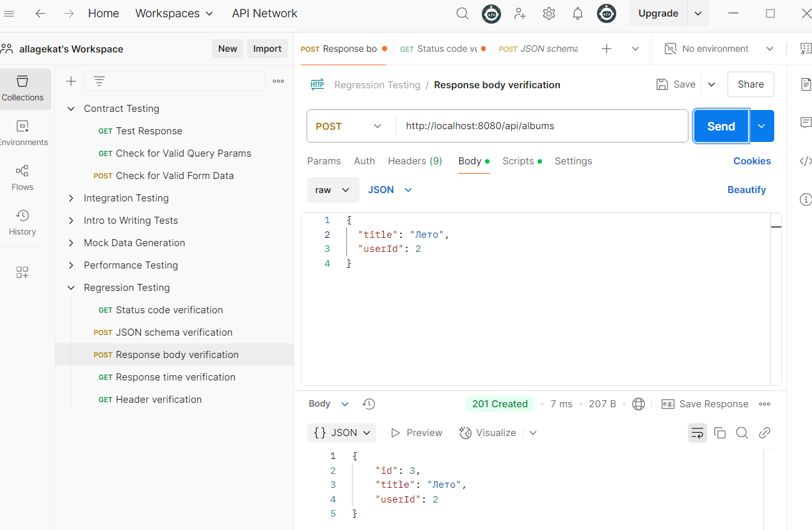

#### 3. Проверка базы данных в H2 Console:
   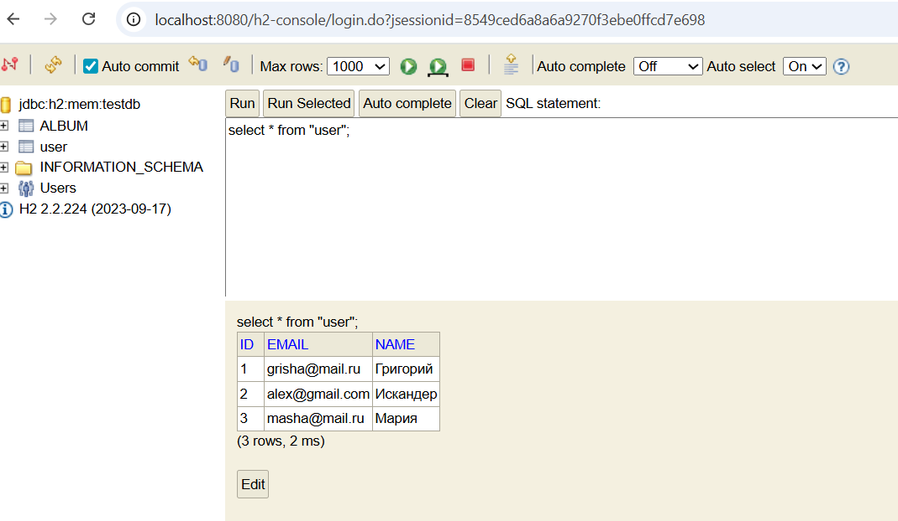
   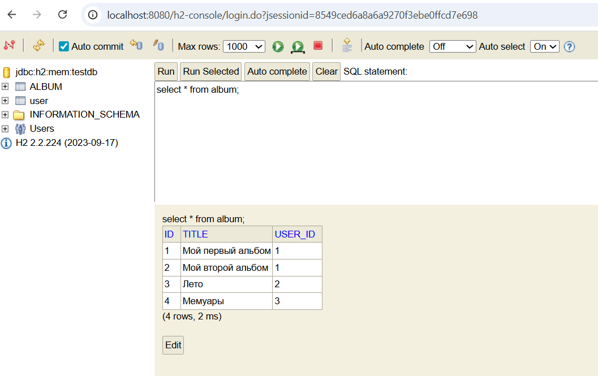

#### 4. Получение информации:
   Получение пользователя по ID
   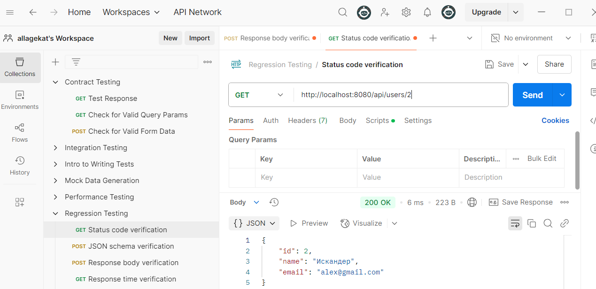
   Получение всех альбомов
   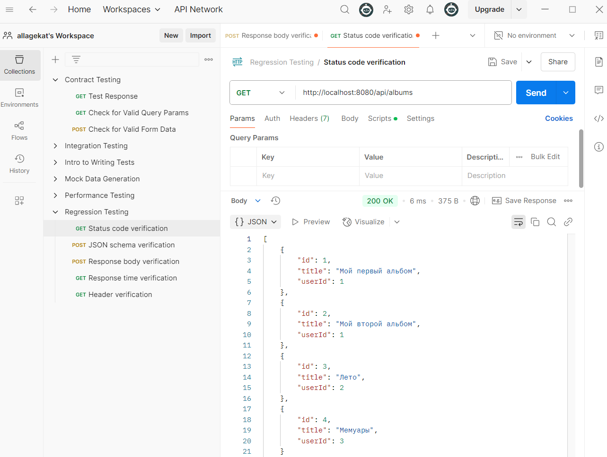
   Получение альбомов пользователя
   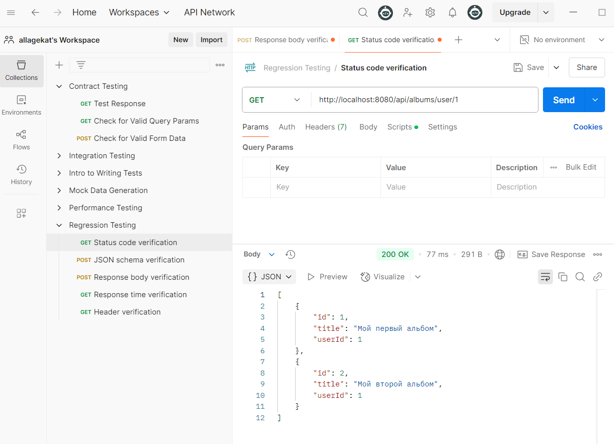

#### 5. Удаление пользователя:
   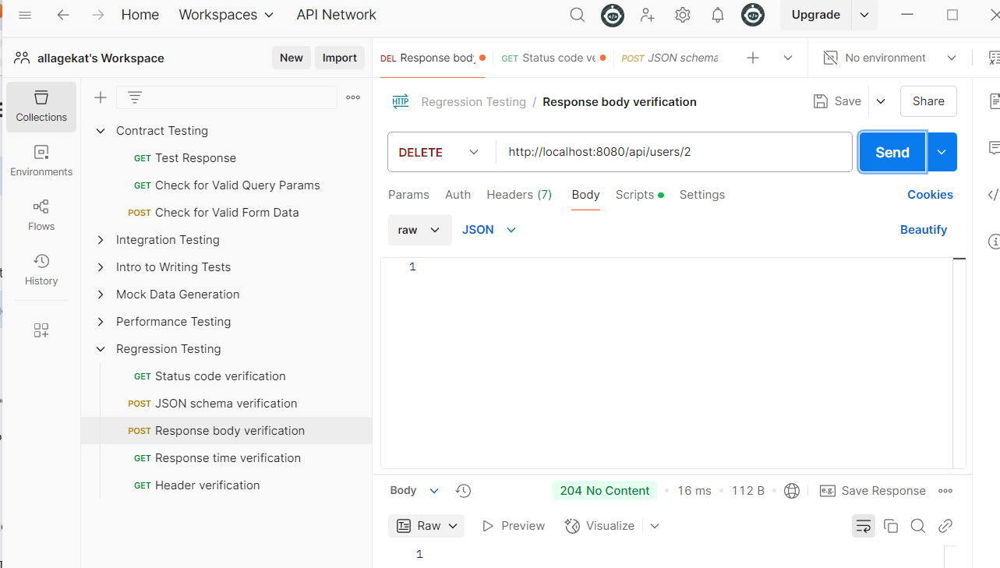
   Проверка пользователей в браузере после удаления:
   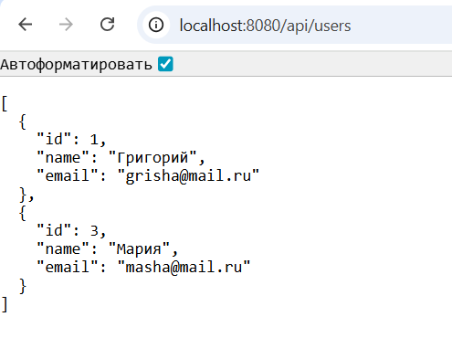

#### 6. Обработка ошибок:
Запрос несуществующего альбома
   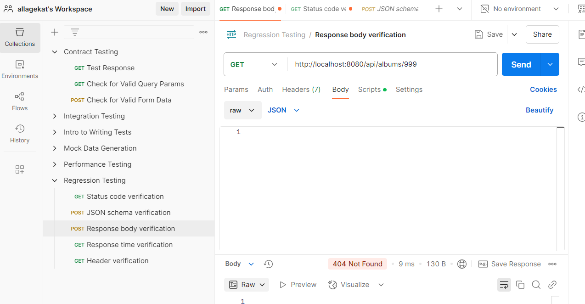

#### 7. Получение информации стороннего API:
Получение всех альбомов внешнего API
   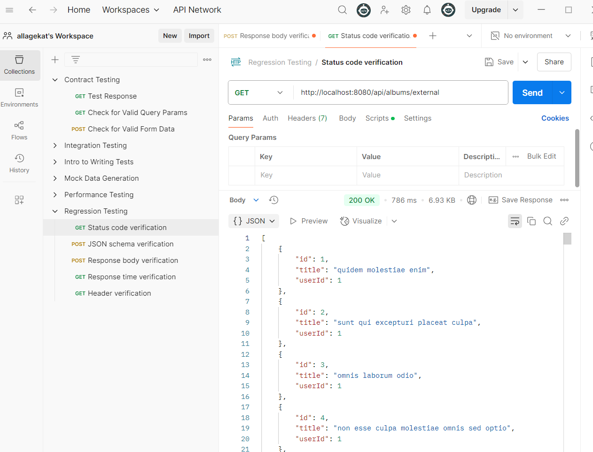
Получение альбома внешнего API по ID
   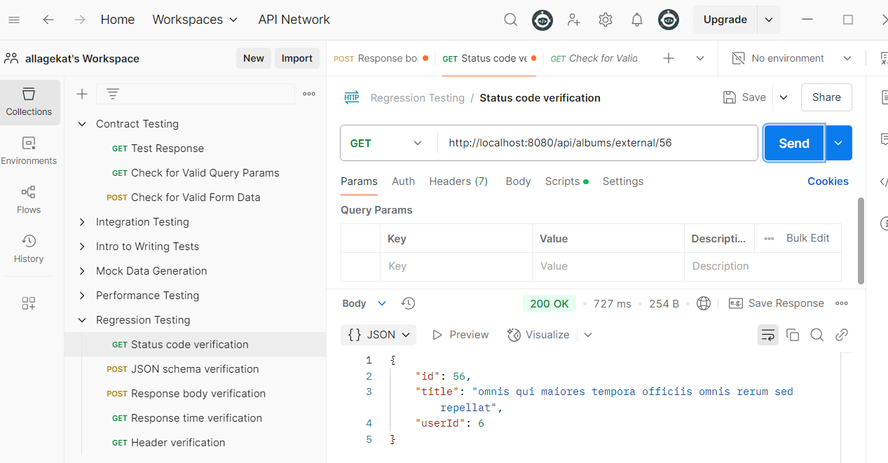
Получение альбомов внешнего API по ID пользователя
   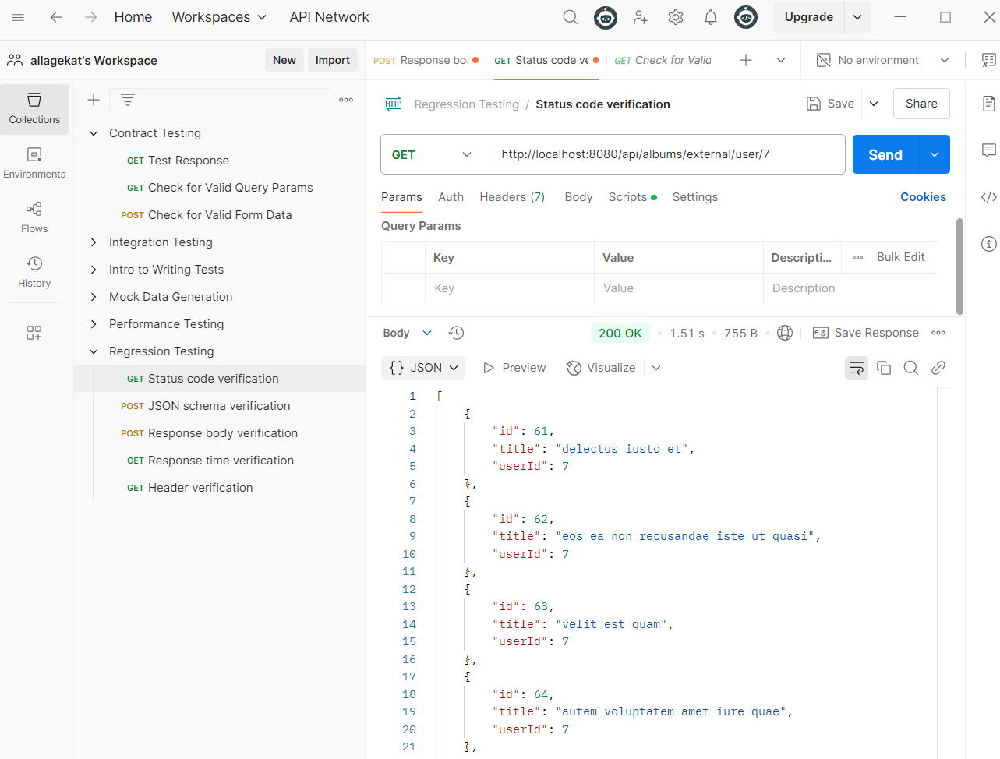
